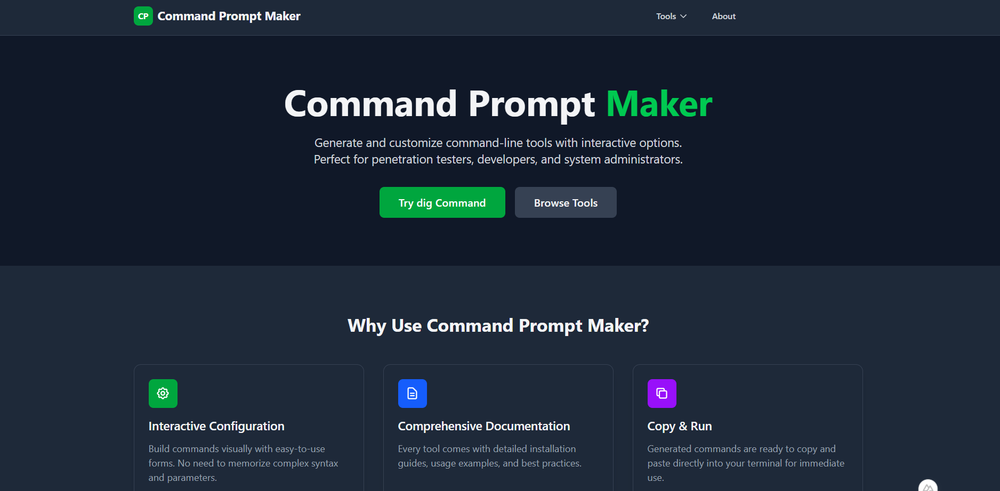
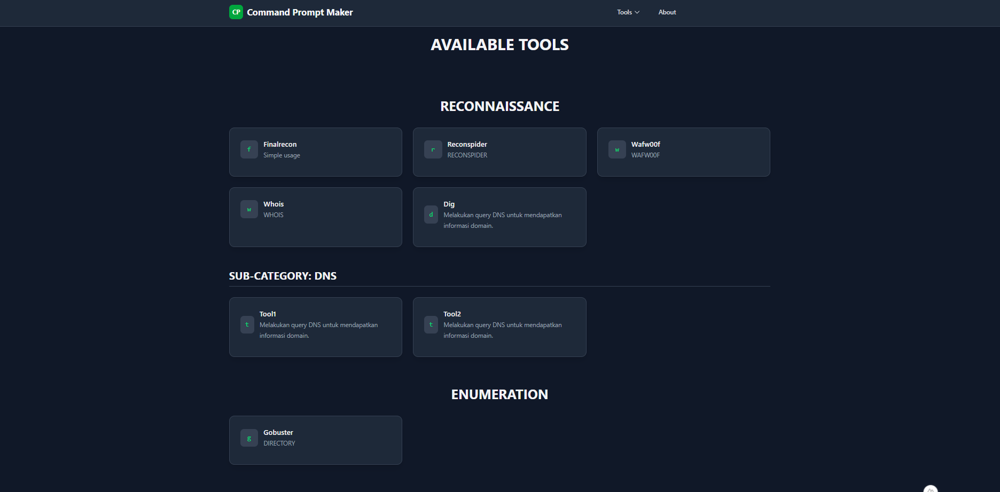
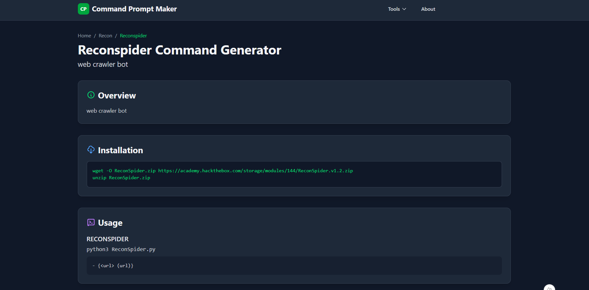
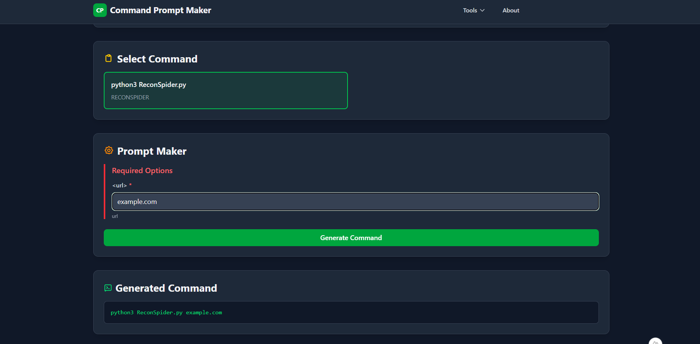
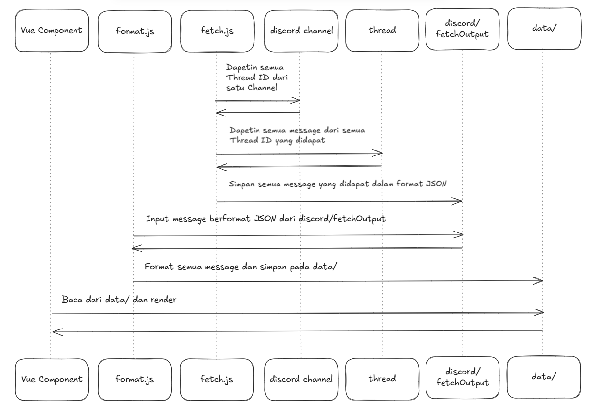

# Command Prompt Generator

<p align="center">
  
</p>

<p align="center">
  
</p>

<p align="center">
  
</p>

<p align="center">
  
</p>

Sebuah aplikasi web berbasis Nuxt.js untuk membuat dan mengelola *command prompt* untuk berbagai *cybersecurity tools*. Proyek ini memiliki alur kerja unik yang memungkinkan pembuatan halaman tool secara otomatis dari catatan yang disimpan di Discord.

---

## ✨ Fitur Utama

-   **Generator Prompt Interaktif**: Membuat baris perintah yang kompleks dengan mudah melalui form yang dinamis dan rekursif.
-   **Tampilan Dokumentasi**: Setiap halaman tool secara otomatis menampilkan *Overview*, *Installation*, dan *Usage* yang terstruktur.
-   **Live Preview**: Perintah yang dihasilkan akan langsung ter-update saat Anda mengubah opsi.
-   **Alur Kerja Berbasis Discord**:
    -   Ambil catatan langsung dari *thread* di channel Discord Anda menggunakan skrip `fetch`.
    -   Ubah catatan Markdown menjadi data tool yang terstruktur secara otomatis menggunakan skrip `format`.
-   **Struktur Skalabel**: Didesain dengan komponen rekursif dan halaman dinamis, memudahkan penambahan tool baru tanpa duplikasi kode.

<p align="center">
  
</p>

---

## 🛠️ Teknologi yang Digunakan

-   **Framework**: [Nuxt.js 3](https://nuxt.com/)
-   **UI Library**: [Vue.js 3](https://vuejs.org/) (Composition API)
-   **Styling**: [Tailwind CSS](https://tailwindcss.com/)
-   **Discord API**: [Discord.js](https://discord.js.org/)
-   **Data Parsing**: Skrip [Node.js](https://nodejs.org/) kustom

---

## 🚀 Memulai Proyek

Berikut adalah cara untuk menjalankan proyek ini di komputer lokal Anda.

### Prasyarat

-   [Node.js](https://nodejs.org/en/) (v18 atau lebih baru)
-   [npm](https://www.npmjs.com/) atau package manager lainnya
-   Sebuah server Discord tempat Anda memiliki izin untuk membuat channel dan mengundang bot.

### Instalasi

1.  **Clone repository ini:**
    ```bash
    git clone https://github.com/Wyze00/Prompt-Generator
    cd nama-folder-proyek
    ```

2.  **Install dependensi:**
    ```bash
    npm install
    ```

3.  **Jalankan Project:**
    ```bash
    npm run dev
    ```

---

## ⚙️ Konfigurasi Integrasi Discord (Opsional)

Ini adalah langkah paling penting untuk menghubungkan aplikasi dengan catatan Discord Anda.

### 1. Buat Discord Bot

-   Buka [Discord Developer Portal](https://discord.com/developers/applications) dan buat aplikasi baru.
-   Buka tab **Bot**, klik "Add Bot".
-   Aktifkan **"Message Content Intent"** di bawah bagian "Privileged Gateway Intents".
-   Klik "Reset Token" untuk mendapatkan token bot Anda.

### 2. Undang Bot ke Server

-   Buka tab **OAuth2 > URL Generator**.
-   Pilih scope `bot`.
-   Pilih izin bot: `View Channel` dan `Read Message History`.
-   Salin URL yang dihasilkan dan buka di browser untuk mengundang bot ke server Anda.

### 3. Siapkan File `.env`

Buat file bernama `.env` di root proyek Anda dan isi dengan format berikut:

```env
# Ganti dengan token bot Anda
DISCORD_BOT_TOKEN="TOKEN_RAHASIA_BOT_ANDA"

# Ganti dengan ID channel utama dan nama untuk file output
CHANNEL_ID="ID_CHANNEL_ANDA"
CHANNEL_NAME="NAMA_CHANNEL_ANDA"
```

## Alur Kerja & Penggunaan

Proyek ini memiliki 3 bagian utama: mengambil data, memformat data, dan menjalankan aplikasi web.

### 1. Menjalankan Aplikasi Web

Untuk menjalankan server development Nuxt, gunakan perintah:

```Bash
npm run dev
```

Aplikasi akan tersedia di `http://localhost:3000`.

### 2. Alur Kerja Konten dari Discord

Untuk menambahkan atau memperbarui tool dari catatan Discord Anda:

### a. Buat Catatan di Discord

- Di dalam channel yang sesuai (misal: `#recon`), buat thread baru untuk setiap tool. Nama thread akan menjadi nama tool (misal: `nmap`).

- Di pesan pertama, tulis dokumentasi menggunakan format yang telah ditentukan (`## OVERVIEW`, `## INSTLATION`, `## USAGE`).
- Template :
```markdown
  ## OVERVIEW (<subcategory>)

  <description>

  ## INSTLATION

  `` `bash
  <installation steps>
  `` `

  ## USAGE

  ### <command> (<description>)

  - **<tools>**
    - {<required> (<description>)}
    - [<optional> (<description>)]
    - {<req1> (<description>) | <req2> (<description>)}
    - [<opt1> (<description>) | <opt> (<description>)]

  ## LINKS

  - <tool1>
  - <tool2>
```

### b. Ambil Pesan dari Discord (Fetch)

Jalankan skrip `fetch.js` untuk mengambil semua thread dari channel yang dikonfigurasi di `.env` dan menyimpannya sebagai file JSON.

```Bash
node fetch.js 
```

Ini akan membuat file seperti `fetchOutput/recon.json`.

### c. Format Data (Format)

Setelah file JSON didapat, jalankan skrip `format.js` untuk mengubahnya menjadi file data `.ts` yang terstruktur.

```Bash
node format.js
```

Ini akan membuat file-file tool di dalam folder `formatOutput/recon`.

Setelah langkah-langkah ini, halaman tool yang baru akan otomatis muncul di aplikasi web Anda saat Anda me-refresh halaman.

--- 

##  📁 Struktur Proyek
Berikut adalah gambaran singkat tentang struktur folder utama:

```
.
├── components/         # Komponen Vue yang reusable 
├── data/               # Pusat data tool yang terstruktur
│   ├── recon/
│   ├── enumeration/
│   └── tools.ts        # Agregator utama
├── pages/              # Struktur routing file-based Nuxt
│   ├── recon/
│   │   └── [...slug].vue # Halaman dinamis untuk tool
├── types/
│   └── interfaces.ts   # Definisi tipe TypeScript
├── discord/            
│   ├── fetch.js        # Script untuk fetch dari discord
│   └── format.js       # Script untuk format fetchOutput
```

## VIBE CODING WITH BOLT & GEMINI